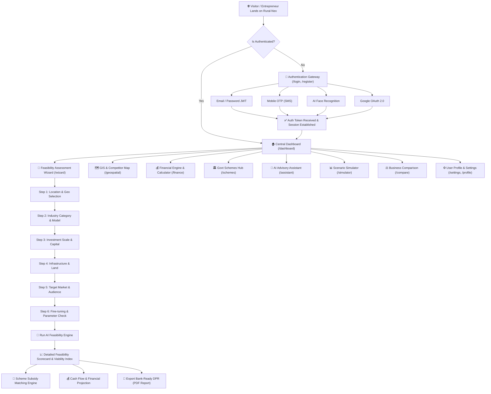
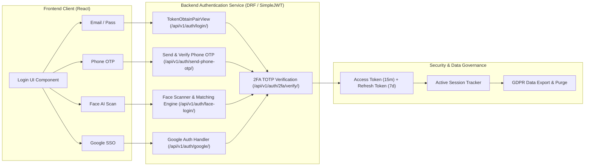
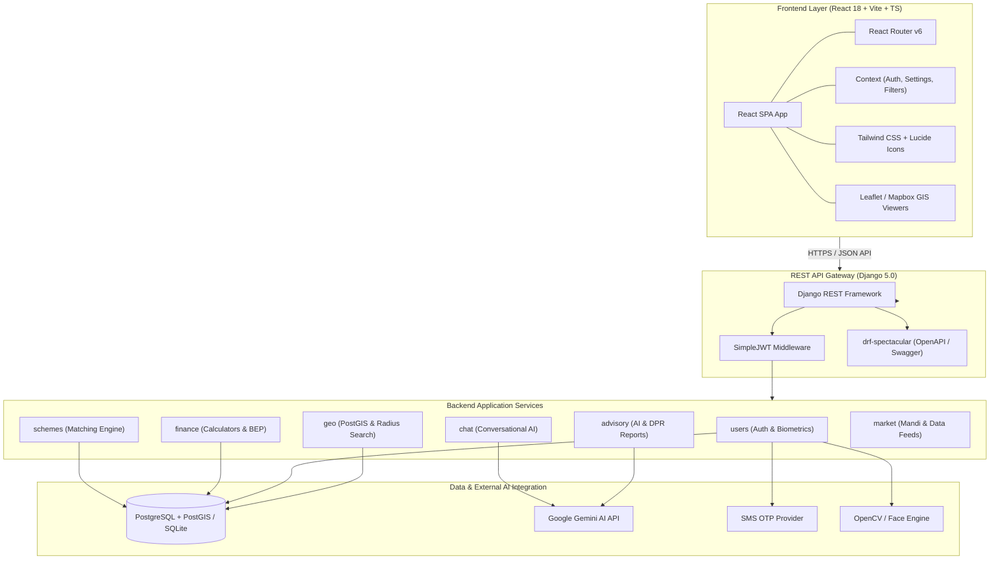
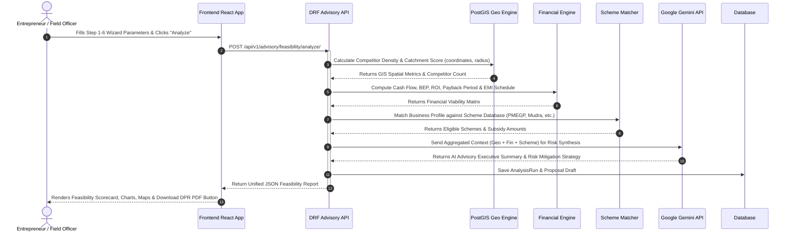

# 🌾 Rural-Nex — AI-Powered Rural Entrepreneurship & Feasibility Platform

[](LICENSE)
[](https://www.djangoproject.com/)
[](https://reactjs.org/)
[](https://postgis.net/)
[](https://tailwindcss.com/)
[](https://ai.google.dev/)
[](https://www.docker.com/)

---

## 📌 Table of Contents
- [Executive Overview](#-executive-overview)
- [Website User Journey & Navigation Flow](#-website-user-journey--navigation-flow)
- [Authentication & Login Ecosystem](#-authentication--login-ecosystem)
- [All Features & Modules Breakdown](#-all-features--modules-breakdown)
  - [1. Guided 6-Step Feasibility Assessment Wizard](#1-guided-6-step-feasibility-assessment-wizard)
  - [2. Interactive GIS & Spatial Competitor Analytics](#2-interactive-gis--spatial-competitor-analytics)
  - [3. Financial Viability Engine & Loan Calculator](#3-financial-viability-engine--loan-calculator)
  - [4. Government Scheme Matching & Subsidy Engine](#4-government-scheme-matching--subsidy-engine)
  - [5. Conversational AI Advisory Assistant](#5-conversational-ai-advisory-assistant)
  - [6. What-If Financial & Feasibility Scenario Simulator](#6-what-if-financial--feasibility-scenario-simulator)
  - [7. Multi-Business Side-by-Side Comparison Engine](#7-multi-business-side-by-side-comparison-engine)
  - [8. Bank-Ready DPR (Detailed Project Report) Generator](#8-bank-ready-dpr-detailed-project-report-generator)
  - [9. Settings, Customization & Multi-lingual i18n Control](#9-settings-customization--multi-lingual-i18n-control)
- [System Architecture & Technology Stack](#-system-architecture--technology-stack)
- [Feasibility Engine & AI Advisory Workflow](#-feasibility-engine--ai-advisory-workflow)
- [API Endpoints Reference](#-api-endpoints-reference)
- [Installation & Setup Guide](#-installation--setup-guide)
  - [Quick Start with Docker Compose](#quick-start-with-docker-compose)
  - [Native Local Setup](#native-local-setup)
  - [Database Seeding](#database-seeding)
- [Security, Privacy & GDPR Controls](#-security-privacy--gdpr-controls)
- [License & Acknowledgments](#-license--acknowledgments)

---

## 🌟 Executive Overview

**Rural-Nex** is an enterprise-grade, AI-powered Business Advisory and Feasibility Ecosystem engineered specifically for rural entrepreneurs, field officers, Self-Help Groups (SHGs), and micro-enterprises. 

In rural economic development, starting a business often suffers from a lack of reliable localized market data, complex financial calculations, and missed government subsidy opportunities. Rural-Nex solves this by bringing together **geospatial intelligence (GIS)**, **automated financial modeling**, **AI-driven market analysis (Google Gemini)**, **government scheme matching**, and **bankable Detailed Project Report (DPR) generation** into a single seamless, multi-lingual platform.

### Core Value Propositions:
- 🗺️ **Hyper-Local Spatial Feasibility**: Analyzes competitor density, population catchment, groundwater levels, and local livestock/mandi economics using PostGIS.
- 💰 **Automated Financial Engine**: Calculates Break-Even Point (BEP), ROI, Net Present Value (NPV), Payback Period, EMI schedules, and working capital needs.
- 📜 **Smart Government Subsidy Matching**: Matches businesses with PMEGP, Mudra, PMFME, NABARD, Stand-Up India, and NRLM schemes to maximize capital grants.
- 🤖 **Bilingual AI Advisory**: Multi-modal voice and text AI guidance in English, Hindi, and regional Indian languages.
- 📄 **Bank-Ready PDF Generation**: Instantly exports official DPR documents formatted for direct submission to PSU banks and District Industry Centres (DIC).

---

## 🌐 Website User Journey & Navigation Flow

The following flowchart details the end-to-end user navigation flow across the Rural-Nex platform, from initial entry and authentication to feasibility assessment, interactive exploration, and document export.



### Navigation Journey Breakdown:
1. **Authentication Gateway**: Users land on the platform and log in via email, phone OTP, facial biometrics, or Google SSO.
2. **Central Dashboard Hub**: Displays key enterprise metrics, past assessment histories, saved schemes, and quick-launch cards for all platform tools.
3. **Feasibility Assessment Wizard**: A guided 6-step questionnaire capturing location, industry model, capital budget, land availability, and market reach.
4. **Interactive Feature Suite**:
   - **Market Analytics**: Explore GIS layers, competitor radius circles, and demographic overlays.
   - **Financial Engine**: Simulate loan repayments, working capital, and break-even points.
   - **Government Schemes**: Match eligibility against live schemes and calculate subsidies.
   - **What-If Simulator**: Adjust price/volume sliders to stress-test business viability under inflation or seasonal drops.
   - **Business Compare**: Compare up to 3 business options side-by-side to choose the safest investment.
5. **DPR Export**: Generate and download an official bank loan proposal report in PDF format.

---

## 🔐 Authentication & Login Ecosystem

Rural-Nex incorporates a multi-tier, enterprise-grade authentication system tailored for diverse rural user demographics—from digitally tech-savvy users to field officers and rural entrepreneurs who prefer biometric or phone OTP sign-ins.



### Detailed Login Features:

| Authentication Method | Technical Implementation | Target User / Use Case |
| :--- | :--- | :--- |
| **Email / Password JWT** | Django REST Framework + SimpleJWT (`TokenObtainPairView`). Issues short-lived access tokens and refresh tokens stored securely. | Standard web users, enterprise officers, administrators. |
| **Mobile Phone + SMS OTP** | Twilio / Indian SMS Gateway integration (`SendPhoneOTPView`, `VerifyPhoneOTPView`). Generates 6-digit cryptographically random OTPs with 5-minute expiry. | Rural entrepreneurs without active email addresses. |
| **AI Facial Recognition Login** | OpenCV & deep-learning biometric embedding vectors (`FaceLoginView`, `FaceEnrollView`). Camera stream captures facial landmarks, compares embedding distance against enrolled profiles. Supports multi-account selection if multiple profiles share a device. | Low-literacy users, quick field officer login without typing credentials. |
| **Google OAuth 2.0 (SSO)** | `@react-oauth/google` integration (`GoogleLoginView`). Validates Google ID token backend-side and provisions user accounts automatically. | One-click login for Google account holders. |
| **Two-Factor Auth (2FA / TOTP)** | Time-based One-Time Password (`Setup2FAView`, `Verify2FAView`). Generates QR codes compatible with Google Authenticator / Authy. | Enhanced account security for administrative or financial officer accounts. |

### Account Security & Session Management Features:
- 📱 **Active Session Tracking**: View all active client sessions (IP address, user agent, login timestamp) via `/api/v1/auth/sessions/`.
- 🔴 **Remote Session Revocation**: Terminate all other active sessions across other devices with a single click (`/api/v1/auth/sessions/revoke-others/`).
- 🔑 **Password Recovery Pipeline**: Email OTP verification (`/api/v1/auth/forgot-password/`) and secure password reset (`/api/v1/auth/reset-password/`).
- 💾 **Remember Me Persistence**: Remembers username locally while keeping auth tokens securely managed in state.
- 🛡️ **GDPR & Privacy Controls**:
  - Export full personal account data (`/api/v1/auth/export-data/`).
  - View stored data item counts (`/api/v1/auth/data-counts/`).
  - Clear historical assessment runs (`/api/v1/auth/clear-assessment-history/`).
  - Purge all user data or permanently delete account (`/api/v1/auth/delete-account/`).

---

## 🚀 All Features & Modules Breakdown

### 1. Guided 6-Step Feasibility Assessment Wizard
The core engine of Rural-Nex provides an intuitive step-by-step wizard to evaluate any rural business concept:
- **Step 1: Location & Geo Selection**: Select State, District, Sub-district/Block, Village, or drop a pin directly on an interactive map.
- **Step 2: Industry Category & Business Model**: Choose from predefined categories (Dairy Farming, Solar Cold Storage, Food Processing, Poultry, Handicrafts, Agro-retail, Organic Fertilizer) or define a custom business model.
- **Step 3: Investment Scale & Capital Allocation**: Input initial capital, equity contribution, expected loan requirement, and equipment costs.
- **Step 4: Infrastructure & Land**: Specify available land area, electricity connection type (Single Phase / 3-Phase / Solar), water supply, and road connectivity.
- **Step 5: Target Market & Demographics**: Define target customer radius (local village vs 10km radius vs urban export), expected daily customer footfall, and selling channel.
- **Step 6: Parameter Fine-Tuning & Analysis Execution**: Review all gathered parameters, fine-tune assumptions, and launch the multi-engine AI analysis.

### 2. Interactive GIS & Spatial Competitor Analytics
Powered by Django's `contrib.gis` (PostGIS) and frontend mapping libraries:
- 📍 **Competitor Density Mapping**: Automatically plots existing businesses within a 5km, 10km, or 25km radius.
- 🎯 **Catchment Heatmaps**: Visualizes customer density and market demand potential around chosen coordinates.
- 📊 **Spatial Layer Overlays**: Overlays government census data, population density, groundwater availability, and livestock census stats onto the map.
- 🏬 **Mandi & Market Price Feeds**: Live and historical agricultural commodity price trends from nearest APMC Mandis.

### 3. Financial Viability Engine & Loan Calculator
A comprehensive financial engine capable of calculating:
- 📈 **Cash Flow & P&L Projections**: Generates 3-to-5-year income statements with revenue estimates and expense itemization (raw materials, labor, power, maintenance).
- ⚖️ **Break-Even Point (BEP)**: Computes break-even sales volume and break-even revenue in INR.
- ⏳ **Payback Period & ROI**: Determines expected months to recover capital and annual Return on Investment (ROI %).
- 📅 **EMI & Repayment Schedule Generator**: Complete monthly amortization table showing principal, interest breakdown, and remaining balance.
- 💼 **Working Capital Estimation**: Calculates recommended operating cash reserve based on operating cycle length.

### 4. Government Scheme Matching & Subsidy Engine
Algorithmic matching of user business profiles against major national and state rural development programs:
- **Supported Schemes**: PMEGP (Prime Minister's Employment Generation Programme), PM Mudra Yojana (Shishu/Kishore/Tarun), PMFME (Formalisation of Micro Food Processing Enterprises), NABARD Rural Schemes, Stand-Up India, NRLM / Aajeevika.
- 💡 **Subsidy Calculator**: Estimates capital subsidy amounts (e.g., 15% to 35% under PMEGP based on General/Reserved category and Urban/Rural location).
- 🔖 **Saved Schemes**: Bookmark eligible schemes, compare benefits side-by-side, and directly link schemes into financial plans.

### 5. Conversational AI Advisory Assistant
An embedded AI consultant powered by Google Gemini 1.5/2.0:
- 🗣️ **Voice-Enabled Interface**: Integrated speech-to-text transcription and text-to-speech audio synthesis.
- 🌐 **Multi-Lingual Support**: Interacts natively in English, Hindi, and regional languages through i18n localization.
- 💡 **Context-Aware Assistance**: The chatbot automatically reads the current active business assessment parameters, allowing users to ask natural questions like *"How can I lower my electricity cost for this dairy plant?"* or *"What permits do I need in Anand district?"*.

### 6. What-If Financial & Feasibility Scenario Simulator
An interactive risk-testing environment:
- 🎚️ **Dynamic Parameter Sliders**: Adjust raw material cost (+/- 30%), selling price (+/- 20%), sales volume (+/- 50%), and utility tariff rates in real time.
- 📉 **Instant Recalculation**: Live re-computation of Net Profit Margin, Break-Even Point, and Feasibility Risk Index without re-running the wizard.

### 7. Multi-Business Side-by-Side Comparison Engine
Designed for entrepreneurs undecided between multiple business opportunities:
- ⚖️ **Side-by-Side Matrix**: Select up to 3 business profiles (e.g., *Poultry Farm* vs *Solar Cold Storage* vs *Goat Farming*).
- 📊 **Comparative Radar Charts**: Visual evaluation across Initial Capital, Projected Monthly Revenue, Risk Score, Market Demand, and Subsidy Availability.

### 8. Bank-Ready DPR (Detailed Project Report) Generator
- 📄 **Automated PDF Export**: Compiles all location stats, spatial maps, financial tables, BEP calculations, scheme subsidy applications, and AI risk assessments into a standard Bank Loan Proposal.
- 🏦 **Institutional Compliance**: Designed according to lending guidelines of NABARD, SBI, Bank of Baroda, Regional Rural Banks (RRBs), and SIDBI.

### 9. Settings, Customization & Multi-lingual i18n Control
- 🌐 **Language Switcher**: Toggle platform interface between English, Hindi, and regional languages seamlessly.
- 💱 **Currency Unit Customizer**: Display financial numbers in absolute INR (₹), Lakhs (₹ L), Crores (₹ Cr), or USD ($).
- 🎨 **Appearance Engine**: Sleek dark mode and high-contrast light mode with glassmorphism UI elements.
- 🤖 **AI Advisor Personalization**: Customize AI advisor tone (Conservative, Balanced, Aggressive) and select underlying LLM model engines.

---

## 🏗️ System Architecture & Technology Stack

Rural-Nex employs a decoupled monorepo architecture combining a high-performance Django REST API backend with a responsive React single-page application.



### Technology Stack Summary Table:

| Layer | Technology | Purpose |
| :--- | :--- | :--- |
| **Frontend Framework** | React 18, TypeScript, Vite | Fast SPA execution, strict typing, hot module reloading. |
| **Styling & UI** | Tailwind CSS, Lucide React, Glassmorphism | Custom design tokens, dark mode, responsive layouts. |
| **Maps & GIS (Frontend)**| Leaflet.js, React-Leaflet, OpenLayers | Interactive spatial plotting and competitor markers. |
| **Backend Framework** | Django 5.0, Django REST Framework (DRF) | Scalable REST API, admin portal, robust ORM. |
| **Geospatial Engine** | GeoDjango, PostGIS, GDAL/GEOS C-Libraries | Spatial queries, ST_DWithin radius search, GIS layers. |
| **Authentication** | SimpleJWT, TOTP (django-otp), OpenCV, Google OAuth | Token security, 2FA, biometric face auth, SSO. |
| **AI & LLM Services** | Google Gemini 1.5 / 2.0 API, gTTS, SpeechRecognition | Feasibility recommendations, voice transcription, AI chat. |
| **Database** | PostgreSQL + PostGIS (Production), SQLite (Dev) | Spatial vector data, user profiles, financial logs. |
| **Containerization** | Docker, Docker Compose | Orchestrated deployment across backend and frontend. |

---

## 📊 Feasibility Engine & AI Advisory Workflow

The sequence diagram below shows how the backend processes a user's feasibility request by synthesizing GIS data, running financial algorithms, matching government schemes, and calling Google Gemini for final recommendations.



---

## 🔌 API Endpoints Reference

### Authentication & User Management (`/api/v1/auth/`)
- `POST /api/v1/auth/register/` — Register a new account.
- `POST /api/v1/auth/login/` — Obtain JWT access and refresh tokens.
- `POST /api/v1/auth/face-login/` — Authenticate via captured biometric face image.
- `POST /api/v1/auth/face-enroll/` — Enroll user face biometric profile.
- `POST /api/v1/auth/send-phone-otp/` — Request SMS OTP code.
- `POST /api/v1/auth/verify-phone-otp/` — Verify SMS OTP code and log in.
- `POST /api/v1/auth/google/` — Authenticate using Google OAuth 2.0 token.
- `GET /api/v1/auth/me/` — Retrieve currently logged-in user profile.
- `POST /api/v1/auth/2fa/setup/` & `verify/` — Configure and verify 2FA TOTP.
- `GET /api/v1/auth/sessions/` — List active sessions across devices.
- `POST /api/v1/auth/sessions/revoke-others/` — Terminate all other user sessions.
- `GET /api/v1/auth/export-data/` — Download full user data export (GDPR).

### Advisory & Feasibility Reports (`/api/v1/advisory/`)
- `POST /api/v1/advisory/feasibility/analyze/` — Execute complete multi-engine feasibility assessment.
- `POST /api/v1/advisory/feasibility/compare/` — Compare multiple business proposals side-by-side.
- `POST /api/v1/advisory/generate/` — Generate AI recommendation using Gemini.
- `GET /api/v1/advisory/reports/<id>/` — Download bank-ready Detailed Project Report (PDF).
- `POST /api/v1/advisory/voice/transcribe/` — Speech-to-text audio input transcription.
- `POST /api/v1/advisory/voice/synthesize/` — Text-to-speech audio synthesis.

### Geospatial & Radius Search (`/api/v1/geo/` or `/api/locations/`)
- `GET /api/v1/geo/hierarchy/` — Dynamic administrative hierarchy (State -> District -> Block -> Village).
- `POST /api/v1/geo/radius-search/` — ST_DWithin spatial competitor search.
- `POST /api/v1/geo/suitability-assessment/` — Compute location suitability index.
- `GET /api/v1/geo/population-data/` & `groundwater-data/` & `livestock-data/` — Spatial layer datasets.

### Financial Engine (`/api/v1/finance/`)
- `POST /api/v1/finance/calculate/` — Financial feasibility, BEP, and payback period calculation.
- `POST /api/v1/finance/repayment/` — Generate monthly loan amortization table.
- `POST /api/v1/finance/working-capital/` — Estimate required working capital reserve.
- `POST /api/v1/finance/dpr/generate/` — Generate structured DPR financial statements.

### Government Schemes (`/api/v1/schemes/`)
- `GET /api/v1/schemes/` — List and search government welfare/entrepreneurship schemes.
- `POST /api/v1/schemes/match/` — Algorithmic matching based on category, location, and investment.
- `GET /api/v1/schemes/<id>/calculate-benefit/` — Calculate category-specific capital subsidies.
- `GET /api/v1/schemes/saved-schemes/` — Manage bookmarked user schemes.

---

## 🛠️ Installation & Setup Guide

### Prerequisites
- **Docker & Docker Compose** (Recommended for seamless GDAL/PostGIS setup)
- **Python 3.10+** & **Node.js 18+** (For native development)
- **GDAL & GEOS C-libraries** (Mandatory for Django GIS if running natively on Windows/Linux)

---

### Quick Start with Docker Compose

1. **Clone the Repository**:
   ```bash
   git clone https://github.com/tirth1632/Rural-Nex.git
   cd Rural-Nex
   ```

2. **Configure Environment Variables**:
   Create a `.env` file in the project root or inside `backend/`:
   ```env
   DEBUG=True
   SECRET_KEY=your-django-secret-key
   GEMINI_API_KEY=your-google-gemini-api-key
   DATABASE_URL=postgis://postgres:postgres@db:5432/ruralnex_db
   ```

3. **Launch Containers**:
   ```bash
   docker-compose build
   docker-compose up -d
   ```

4. **Apply Database Migrations**:
   ```bash
   docker-compose exec backend python manage.py migrate
   ```

5. **Access Platform**:
   - **Frontend App**: `http://localhost:5173`
   - **Backend API**: `http://localhost:8000`
   - **Swagger API Specs**: `http://localhost:8000/api/docs/`

---

### Native Local Setup

#### Backend Setup (Django)
1. **Navigate to backend**:
   ```bash
   cd backend
   ```
2. **Create and activate virtual environment**:
   ```bash
   python -m venv venv
   # On Windows:
   .\venv\Scripts\activate
   # On Linux/macOS:
   source venv/bin/activate
   ```
3. **Install GDAL Binaries & Dependencies**:
   - On Windows, install the matching GDAL wheel included in `backend/GDAL-3.9.2-cp310-cp310-win_amd64.whl`:
     ```bash
     pip install GDAL-3.9.2-cp310-cp310-win_amd64.whl
     ```
   - Install requirements:
     ```bash
     pip install -r requirements.txt
     ```
4. **Run Migrations & Start Server**:
   ```bash
   python manage.py migrate
   python manage.py runserver 8000
   ```

#### Frontend Setup (React + Vite)
1. **Navigate to frontend**:
   ```bash
   cd frontend
   ```
2. **Install Dependencies**:
   ```bash
   npm install
   ```
3. **Launch Vite Dev Server**:
   ```bash
   npm run dev
   ```

---

### Database Seeding

To populate state boundaries, districts, sample business models, and government schemes, run the seed scripts:

```bash
# Seed State & Union Territory Data
python manage.py shell < seed_states.py
python manage.py shell < seed_districts.py
python manage.py shell < seed_uts.py
python manage.py shell < seed_ut_districts.py

# Seed Business Models & Datasets
python seed_dataset_models.py
```

---

## 🛡️ Security, Privacy & GDPR Controls

Rural-Nex prioritizes data protection, especially when handling sensitive personal business ideas and financial profiles:
- 🔐 **JWT Token Expiry**: Access tokens expire after 15 minutes; refresh tokens automatically rotate.
- 🛡️ **Session Revocation**: Device fingerprinting tracks logins and enables remote sign-out across devices.
- 🔒 **Data Minimization**: Biometric facial embeddings are converted into non-reversible mathematical vectors and never stored as raw image files on servers.
- 📄 **Data Export & Privacy Rights**: Full user compliance features enabling users to view data counts, export data archives in JSON format, or permanently delete accounts and assessment histories.

For comprehensive security details, see [docs/SECURITY.md](docs/SECURITY.md).  
For in-depth technical code explanations, mathematical algorithms, error handling strategies, and architectural flowcharts, see [docs/TECHNICAL_DOCUMENTATION.md](docs/TECHNICAL_DOCUMENTATION.md).

---

## 📜 License & Acknowledgments

Distributed under the **MIT License**. See `LICENSE` for more information.

Developed with ❤️ for **Smart India Hackathon (SIH)** to empower rural innovation and economic growth across India.


