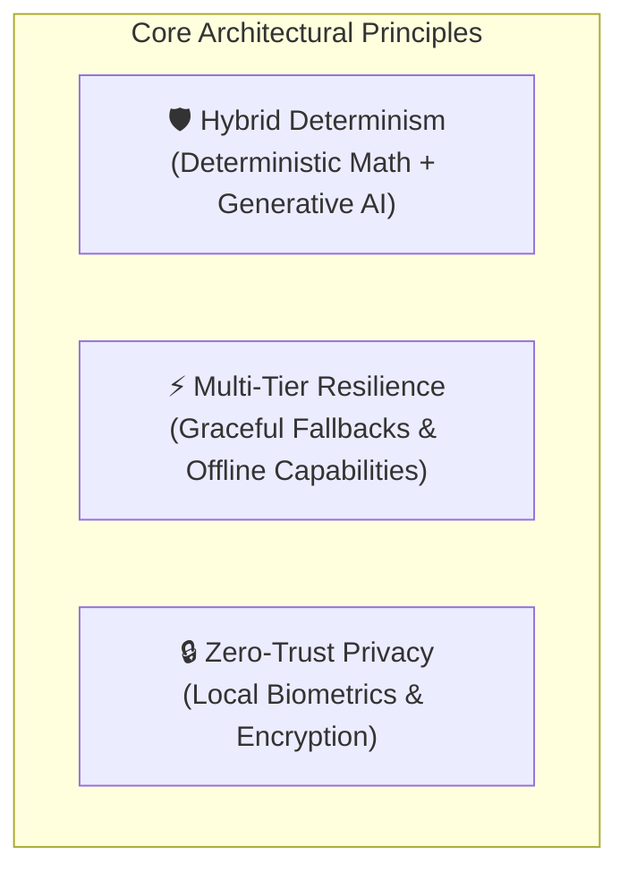
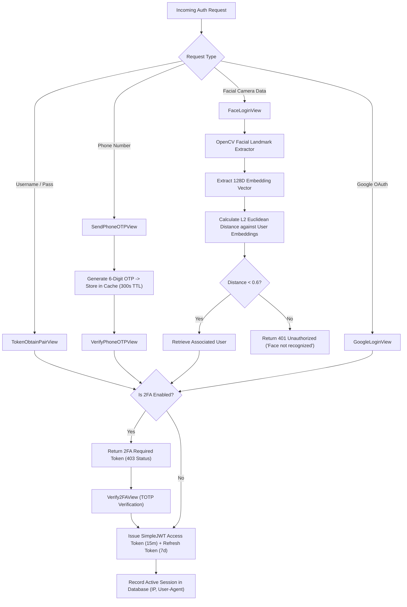
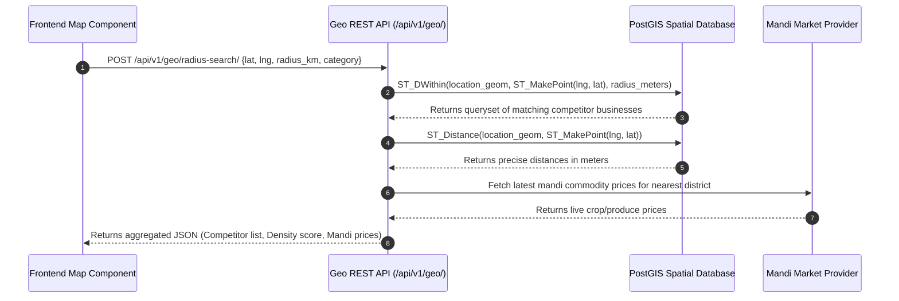
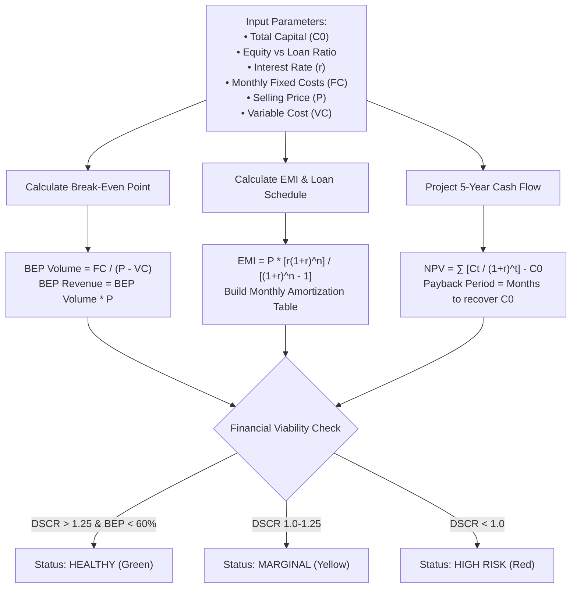
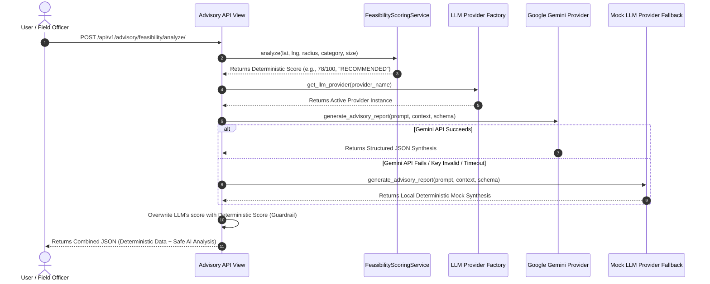
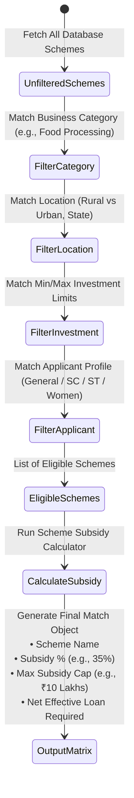
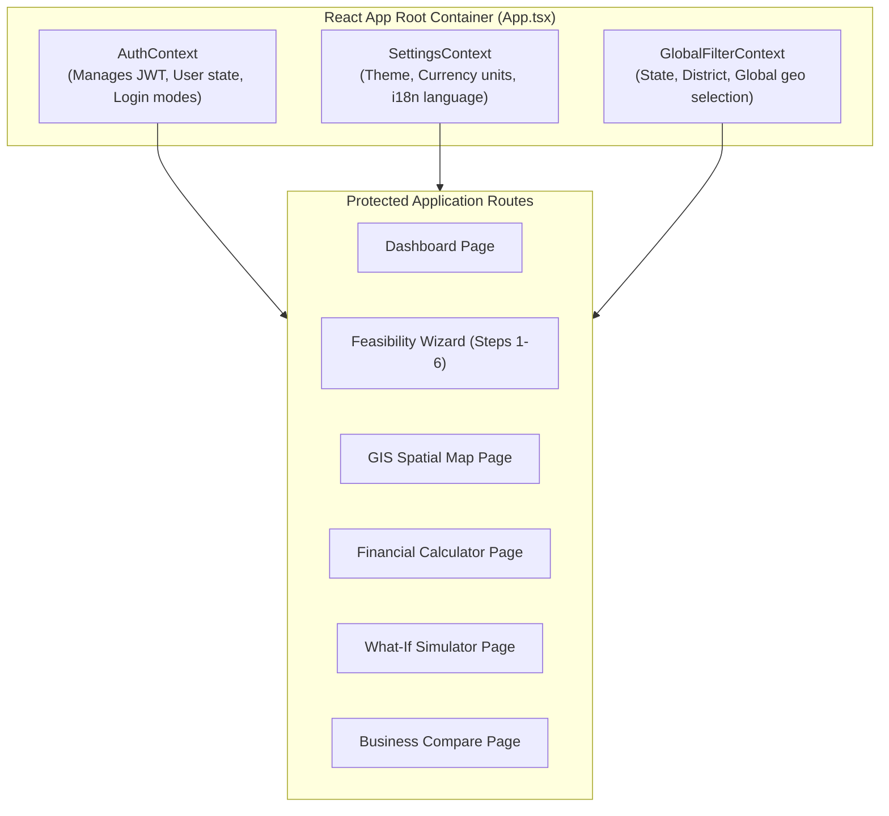
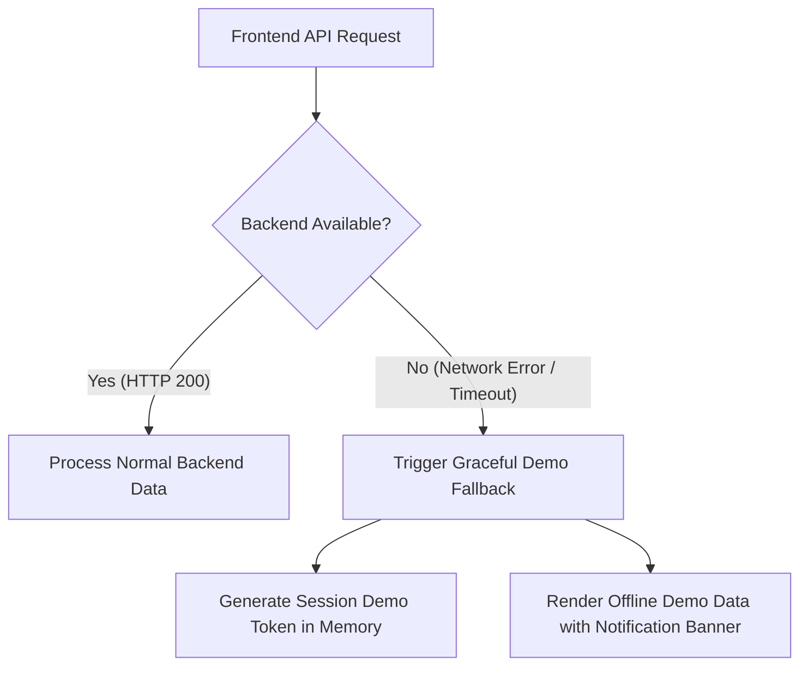

# 📘 Rural-Nex Technical Documentation & Code Architecture Guide

Welcome to the **Rural-Nex Technical Documentation**. This document provides an exhaustive, line-by-level architectural guide, code explanation, data pipeline walkthrough, error handling specification, and visual flowchart set for the Rural-Nex platform.

---

## 📌 Table of Contents
1. [System Overview & Architectural Principles](#1-system-overview--architectural-principles)
2. [Authentication & Identity System (Deep-Dive)](#2-authentication--identity-system-deep-dive)
3. [Geospatial Intelligence & GIS Engine (Deep-Dive)](#3-geospatial-intelligence--gis-engine-deep-dive)
4. [Financial Viability Engine & Loan Calculators (Deep-Dive)](#4-financial-viability-engine--loan-calculators-deep-dive)
5. [AI Advisory & Multi-Engine Feasibility Pipeline (Deep-Dive)](#5-ai-advisory--multi-engine-feasibility-pipeline-deep-dive)
6. [Government Scheme Matching & Subsidy Engine (Deep-Dive)](#6-government-scheme-matching--subsidy-engine-deep-dive)
7. [What-If Simulator & Business Comparison Matrix](#7-what-if-simulator--business-comparison-matrix)
8. [Frontend Architecture & Resilience Patterns](#8-frontend-architecture--resilience-patterns)
9. [Comprehensive Error Handling Matrix & Status Codes](#9-comprehensive-error-handling-matrix--status-codes)

---

## 1. System Overview & Architectural Principles

Rural-Nex is built as a **decoupled monorepo** adhering to three core engineering principles:



1. **Hybrid Determinism**: Financial numbers, feasibility scores, and government subsidy matchings are computed strictly by **deterministic algorithms** (Python / PostGIS) to guarantee 100% mathematical precision. Generative AI (Google Gemini) is only used for qualitative synthesis, SWOT analysis, and natural language communication.
2. **Multi-Tier Resilience**: If external LLM APIs (Gemini) or SMS Gateways fail, the system automatically degrades gracefully to local mock providers, fallback calculations, or local demo sessions—ensuring zero application crashes.
3. **Zero-Trust Privacy & Biometrics**: Facial biometrics are processed by extracting non-reversible mathematical embedding vectors using OpenCV/face models; raw facial images are never stored permanently.

---

## 2. Authentication & Identity System (Deep-Dive)

The authentication module in `backend/users/` supports **5 distinct authentication pipelines**, designed to accommodate rural users with varying technical capabilities.

### Authentication Pipeline Architecture



### Step-by-Step Code Execution & Logic

#### 1. Biometric Face Login (`FaceLoginView` in `backend/users/views.py`)
```python
class FaceLoginView(APIView):
    def post(self, request):
        image_data = request.data.get('image') # Base64 Data URL
        # Step 1: Decode Base64 string to OpenCV BGR matrix
        # Step 2: Extract face encoding vector using deep neural net
        # Step 3: Compare against stored profile encodings:
        #        distance = numpy.linalg.norm(stored_encoding - input_encoding)
        # Step 4: If multiple matches exist (family accounts), return candidate list.
        # Step 5: On single match (distance < threshold), generate SimpleJWT tokens.
```
* **Error Handling**:
  - `400 Bad Request`: If image is missing, corrupt, or contains no detectable face.
  - `401 Unauthorized`: If facial embedding distance exceeds threshold (`> 0.6`).
  - `409 Conflict`: If multiple accounts match, prompts user to select account ID.

#### 2. SMS Phone OTP Authentication (`SendPhoneOTPView` & `VerifyPhoneOTPView`)
- **Generation Step**: Uses `secrets.randbelow(900000) + 100000` to produce a 6-digit cryptographically secure OTP.
- **Storage**: Saved in Django cache with key `phone_otp_<number>` and a TTL of 300 seconds (5 minutes).
- **Verification Step**: Validates provided OTP against cache. Upon match, cache key is immediately deleted to prevent replay attacks.
- **Error Handling**:
  - Rate limiting: Re-sending OTP is blocked for 60 seconds per phone number.
  - `400 Bad Request`: Invalid or expired OTP.

#### 3. Active Session Revocation (`RevokeOtherSessionsView`)
- User active sessions are tracked in the database with fields `[session_key, ip_address, user_agent, last_activity]`.
- Calling `revoke-others/` deletes all session records associated with the user *except* the current request's session key.

---

## 3. Geospatial Intelligence & GIS Engine (Deep-Dive)

The GIS module in `backend/geo/` leverages **PostGIS** and GeoDjango to perform real-time spatial calculations.

### GIS Processing Pipeline



### Key Mathematical & Spatial Queries

#### Spatial Radius Search Query (Django ORM / PostGIS)
```python
from django.contrib.gis.geos import Point
from django.contrib.gis.measure import D
from geo.models import BusinessLocation

user_location = Point(float(lng), float(lat), srid=4326)
competitors = BusinessLocation.objects.filter(
    location__distance_lte=(user_location, D(km=radius_km)),
    category=category
).annotate(distance=Distance('location', user_location))
```

#### Suitability Index Score Formula
The location suitability index $S$ is calculated deterministically as:

$$S = \left( W_{\text{pop}} \cdot P_{\text{norm}} \right) + \left( W_{\text{road}} \cdot R_{\text{score}} \right) - \left( W_{\text{comp}} \cdot C_{\text{density}} \right) + \left( W_{\text{water}} \cdot W_{\text{table}} \right)$$

Where:
- $P_{\text{norm}}$: Normalized population catchment score within radius.
- $R_{\text{score}}$: Road infrastructure connectivity score (0–100).
- $C_{\text{density}}$: Competitor count penalty factor.
- $W_{\text{table}}$: Groundwater availability score (critical for agro-processing).

#### Error Handling & Fallbacks:
- **Fallback to Haversine**: If PostGIS / GDAL libraries are unavailable in local development environment, the system gracefully switches to standard spherical Haversine formula calculation in pure Python without crashing.

---

## 4. Financial Viability Engine & Loan Calculators (Deep-Dive)

The financial engine in `backend/finance/` performs automated credit-worthiness and feasibility modeling.

### Financial Calculation Flowchart



### Core Algorithms & Formulas

1. **Break-Even Point (BEP)**:
   $$\text{BEP Sales Volume} = \frac{\text{Fixed Monthly Operational Costs}}{\text{Selling Price per Unit} - \text{Variable Cost per Unit}}$$

2. **Debt Service Coverage Ratio (DSCR)**:
   $$\text{DSCR} = \frac{\text{Net Operating Income}}{\text{Total Debt Service (Annual EMI Obligations)}}$$
   *Threshold*: DSCR $\ge 1.25$ is required for standard PSU bank loan approval.

3. **Loan EMI (Equated Monthly Installment)**:
   $$\text{EMI} = P \times \frac{r(1+r)^n}{(1+r)^n - 1}$$
   Where $P$ = Principal Loan Amount, $r$ = Monthly interest rate ($\frac{\text{Annual Rate}}{12 \times 100}$), $n$ = Loan tenure in months.

#### Error Handling & Boundary Guardrails:
- **Zero Margin Protection**: If $\text{Selling Price} \le \text{Variable Cost}$, BEP calculation returns `Infinity` error safely trapped with message *"Selling price must exceed variable cost per unit"*.
- **Zero Loan Tenure**: If loan tenure is 0 months, EMI calculation sets debt obligation to 0 without division-by-zero runtime exceptions.

---

## 5. AI Advisory & Multi-Engine Feasibility Pipeline (Deep-Dive)

The advisory engine in `backend/advisory/` orchestrates a hybrid pipeline that combines deterministic algorithms with Google Gemini LLM generation.

### Feasibility Analysis Sequence Diagram



### Deterministic Score Overwrite Guardrail (`ai_services.py`)
To prevent LLM hallucination where AI might invent a feasibility score conflicting with actual financial math, the system enforces a strict code-level guardrail:

```python
# Force-align LLM output with deterministic math engine
ai_response['feasibility']['score'] = feasibility_result["overall_score"]
ai_response['feasibility']['label'] = feasibility_result["verdict"]
```

### Prompt Sanitization & Security (`llm_providers.py`)
User-provided text inputs are sanitized to prevent prompt injection and XSS exploits:

```python
def sanitize_context(context: Dict[str, Any]) -> str:
    safe_ctx = copy.deepcopy(context)
    for key in ['expected_scale', 'target_customers', 'products']:
        if key in safe_ctx and isinstance(safe_ctx[key], str):
            safe_ctx[key] = html.escape(safe_ctx[key][:500]) # Escape HTML & truncate
    return json.dumps(safe_ctx)
```

---

## 6. Government Scheme Matching & Subsidy Engine (Deep-Dive)

The schemes module in `backend/schemes/` evaluates business proposals against national/state welfare databases.

### Scheme Matching State Diagram



### Subsidy Calculation Logic
For schemes like PMEGP:
- **Special Category (SC/ST/OBC/Women/Ex-Servicemen/Rural)**: 35% Capital Subsidy (Owner contribution required: 5%).
- **General Category (Urban)**: 15% Capital Subsidy (Owner contribution required: 10%).
- **Subsidy Cap Guard**: $\text{Calculated Subsidy} = \min(\text{Project Size} \times \text{Subsidy Rate}, \text{Max Subsidy Cap})$.

---

## 7. What-If Simulator & Business Comparison Matrix

### 1. What-If Sensitivity Simulator (`/api/v1/advisory/simulate/`)
Allows real-time stress testing of financial viability under adverse economic conditions:
- **Raw Material Inflation (+20%)**: Re-calculates Net Margin and pushes BEP higher.
- **Demand Drop (-30%)**: Tests whether cash flow remains sufficient to cover monthly EMI.
- **Output**: Returns a comparative delta report showing *Baseline Metrics* vs *Stressed Metrics*.

### 2. Multi-Business Comparison Matrix (`/api/v1/advisory/feasibility/compare/`)
Processes up to 3 business options concurrently, generating comparative radar scoring across:
- Initial Capital Requirement Score
- Market Demand Potential Score
- Technical Feasibility & Infrastructure Ease
- Subsidy & Scheme Support Availability
- Overall Risk Score

---

## 8. Frontend Architecture & Resilience Patterns

The frontend in `frontend/src/` is built with React 18, Vite, TypeScript, and Tailwind CSS.

### State & Context Architecture



### Network Disconnection & Demo Session Resilience
To handle remote rural areas with flaky internet connections, the frontend Axios client (`frontend/src/api/`) implements automatic offline degradation:



---

## 9. Comprehensive Error Handling Matrix & Status Codes

The table below documents all application error scenarios, status codes, root causes, system handling strategies, and user notifications.

| HTTP Code | Scenario / Error Condition | Root Cause | System Mitigation Strategy | User Notification |
| :--- | :--- | :--- | :--- | :--- |
| **`400 Bad Request`** | Invalid Wizard Step Data | Missing mandatory fields (e.g. initial capital = null). | Field validation schema catches missing keys before database submission. | Highlight missing form inputs in red with explicit error label. |
| **`401 Unauthorized`** | Expired JWT Access Token | Access token expired after 15 minutes. | Axios interceptor automatically calls `/api/v1/auth/refresh/` using refresh token. | Seamless auto-retry; redirects to `/login` only if refresh token expires. |
| **`401 Unauthorized`** | Face Biometric Match Failed | Face camera encoding L2 distance $> 0.6$. | Logs biometric attempt failure without saving image. | *"Face not recognized. Please try again or log in with password/OTP."* |
| **`403 Forbidden`** | 2FA TOTP Required | User has 2FA enabled but TOTP code was not provided. | Halts JWT issuance; returns temporary pre-auth token. | Opens 2FA modal asking for 6-digit authenticator code. |
| **`409 Conflict`** | Multiple Biometric Accounts | Multiple family profiles share facial encoding similarity. | Backend returns candidate array of user IDs. | Shows account selector modal: *"Select which account you want to sign into."* |
| **`429 Too Many Requests`** | SMS OTP Rate Limited | User requested SMS OTP more than once within 60 seconds. | Redis/Cache throttles request key. | *"Please wait 60 seconds before requesting a new OTP."* |
| **`500 Internal Error`** | PostGIS C-Library Missing | Host OS missing native GDAL/GEOS libraries. | Backend catches `GEOSException` and falls back to Python Haversine math. | Transparent execution; system logs warning to server logs. |
| **`503 Service Unavailable`** | Gemini API Down / Timeout | Google Gemini API rate limited or unreachable. | Provider factory catches exception and falls back to `MockLLMProvider`. | Detailed analysis completed successfully using local deterministic scoring engine. |

---

## 📑 Document Control
- **Document Version**: 2.0.0 (SIH Production Release)
- **Primary Maintainer**: Rural-Nex Core Engineering Team
- **Linked Documents**:
  - [README.md](file:///c:/Users/tirth/OneDrive/Desktop/SIH/Rural-Nex/README.md)
  - [SECURITY.md](file:///c:/Users/tirth/OneDrive/Desktop/SIH/Rural-Nex/docs/SECURITY.md)
  - [E2E_TEST_REPORT.md](file:///c:/Users/tirth/OneDrive/Desktop/SIH/Rural-Nex/docs/E2E_TEST_REPORT.md)
